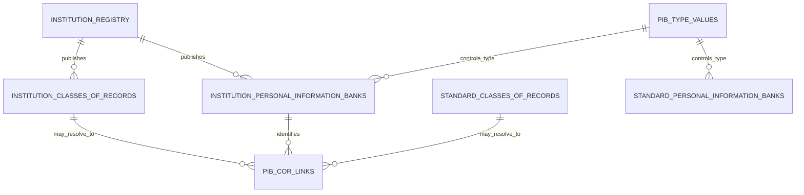

# PIBs relational data model

The machine-readable model is [`data_model.json`](data_model.json). Its hub is the
authoritative `institution_registry.institution_id`; `gc_orgID` remains an optional external
identifier and is not used as a filesystem or relational key.

`pib_cor_links.csv` normalizes the many-to-many relationship currently embedded in the
English and French `related_record_number` text. Its `relationship_scope` distinguishes
institution-specific from standard Classes of Records, and `resolved` makes unresolved source
references auditable rather than silently discarding them.

`pi_categories_en_fr.csv` is a controlled vocabulary, but current Info Source publications do
not provide explicit category assignments for each PIB. The model therefore records it as an
available vocabulary without inferring assignments from narrative descriptions.
