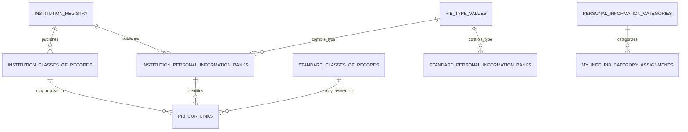

# PIBs relational data model

The machine-readable model is [`data_model.json`](data_model.json). Its hub is the
authoritative `institution_registry.institution_id`; `gc_orgID` remains an optional external
identifier and is not used as a filesystem or relational key.

`pib_cor_links.csv` normalizes the many-to-many relationship currently embedded in the
English and French `related_record_number` text. Its `relationship_scope` distinguishes
institution-specific from standard Classes of Records, and `resolved` makes unresolved source
references auditable rather than silently discarding them.

The institution PIB table stores explicit description enumerations in
`specific_information_types_en` and `specific_information_types_fr`. These fields are JSON arrays
inside the CSV so individual source-language values remain unambiguous even when they contain
commas. They are conservative derivations: an empty array means no explicit list phrase was found,
not that the underlying PIB contains no personal information.

The adjacent `standard_personal_information_category_ids`,
`standard_personal_information_categories_en`, and
`standard_personal_information_categories_fr` JSON arrays contain conceptual matches against the
official category vocabulary. The derivation considers only the bilingual PIB descriptions and
their extracted specific information types; it does not infer categories from program titles,
purposes, uses, or institution names.

`pi_categories_en_fr.csv` is the official controlled vocabulary, but current Info Source
publications do not provide explicit category assignments for each PIB. My Info therefore keeps
the compiler's deterministic description-based assignments in a separate derived table. Every relationship has
confidence and source-field evidence, and is presented as an estimate rather than source metadata.

`data/derived/my_info/my_info_pib_features.csv` uses a source-scoped `record_id` so standard and
institution-specific PIBs can share one feature table without conflating reused bank numbers. The
full category, interaction, retention, bilingual, and matching evidence is retained in
`my_info_derivation_evidence.jsonl`.
