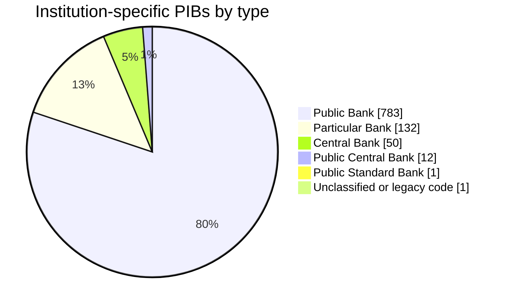
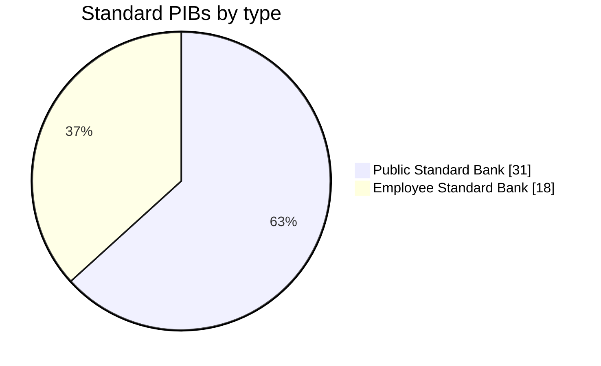

# pibs

## Authoritative institution registry

`institution_registry.csv` is the bilingual registry of the 148 government institutions
listed in Schedule I of the Access to Information Act. Legal membership and names come only
from the Act XML. Treasury Board's bilingual publication-requirements appendices supply the
annual Info Source due date; Open Government's organization directory and two organization
datastore resources supply identifiers and metadata. Those enrichment sources never add or
remove a Schedule I institution.

The registry also records the English and French Info Source report URL and separate PIB and
Class-of-Records URLs when an institution publishes those holdings on another page. A blank URL
means that no sufficiently reliable institution report was found; it is not replaced by a fuzzy
match. Matching method, score, evidence URL, source URLs, validation result, and HTTP status are
retained in the output. Curated exceptions are reviewable in
`data/institution_registry_overrides.csv`.

Rebuild from a dated, reproducible raw-source snapshot and then audit the publication links:

```bash
.venv/bin/python build_institution_registry.py --snapshot-date 2026-08-15 --refresh
.venv/bin/python audit_institution_registry_urls.py --as-of-date 2026-08-15
.venv/bin/python -m unittest tests.test_institution_registry
```

Raw responses and their SHA-256 manifest are stored under
`data/raw/institution-registry/<date>/`; URL-audit metadata is stored under `data/audits/`.
The Excel equivalent is `institution_registry.xlsx`, and the site copy is
`site/data/institution_registry.csv`.

Treasury Board's due-date appendix currently contains 196 reporting entries because its stated
scope also covers parent Crown corporations and wholly owned subsidiaries. The 148-row registry
deliberately answers the Act Schedule I membership question. The pre-existing
`infosource_institutions_en_fr.csv` remains the broader operational publication directory and is
not a substitute for the legal registry.

### Institution content refresh

The current collector uses stable `institution_id` directories and preserves dated raw responses,
role-specific Markdown, source checksums, fetch results, and extraction counts. Prepare a job
manifest, run one or more disjoint batches, rebuild with the current parsers, and compile only
after every batch finishes:

```bash
.venv/bin/python prepare_institution_collection_jobs.py --snapshot-date 2026-08-15
.venv/bin/python collect_institution_content.py \
  --jobs-file data/collection_jobs/institution_collection_jobs_2026-08-15.jsonl \
  --batch-index 0 --batch-count 1
.venv/bin/python rebuild_institution_extractions.py \
  --jobs-file data/collection_jobs/institution_collection_jobs_2026-08-15.jsonl
.venv/bin/python compile_institution_tables.py \
  --jobs-file data/collection_jobs/institution_collection_jobs_2026-08-15.jsonl
.venv/bin/python summarize_institution_collection.py \
  --jobs-file data/collection_jobs/institution_collection_jobs_2026-08-15.jsonl \
  --status-csv data/collection_jobs/institution_collection_status_2026-08-15.csv \
  --summary-json data/collection_jobs/institution_collection_summary_2026-08-15.json
.venv/bin/python validate_institution_collection.py \
  --jobs-file data/collection_jobs/institution_collection_jobs_2026-08-15.jsonl
```

Each collectable institution receives `pib_table_en_fr.csv` and `cor_table_en_fr.csv`. The latter
has exactly `record_number`, `name_en`, `name_fr`, `document_types_en`, and `document_types_fr`.
The compiler writes registry-keyed comprehensive tables and site copies, and rejects stale parser
versions, missing outputs, or duplicate canonical keys.

The dated status CSV and JSON summary distinguish successful retrievals, source errors, missing
URLs, and successful pages with zero extracted holdings. For the 2026-08-15 snapshot, all 131
collectable institutions completed; 99 yielded at least one source, while 17 additional registry
institutions had no publication URL suitable for collection.

The relational and controlled-vocabulary model is documented in `DATA_MODEL.md` and declared in
`data_model.json`. Validate its primary keys and foreign keys with:

```bash
.venv/bin/python validate_data_model.py
```

## Standard classes of records

Run `python scrape_standard_classes_of_records.py` to retrieve the English and French
Canada.ca source pages and rebuild `standard_classes_of_records_en_fr.csv`. English
`PRN ###` entries are paired with French `NDP ###` entries by their shared numeric code;
the script stops if either language is missing a matching record.

## PIB types

`pib_types.py` contains the Annex B lookup used by `spib_scraper_(1).py` and
`combine_pib_tables.py`. Both bilingual PIB outputs include a `pib_type` column derived
from the bank code. Codes outside the six Annex B families are left unclassified.

`spib_scraper_(1).py` also rebuilds `pi_categories_en_fr.csv` from the bilingual
Categories of Personal Information lists. `PI_CAT-1` through `PI_CAT-25` follow the
English source order and are paired to the differently ordered French list by translated name.

### Institution-specific PIBs by type



### Standard PIBs by type



## Institution change tracking

Run `python infosource_institutions_en_fr.py` to refresh the legacy operational publication list.
Run `python audit_zero_pib_infosource_urls.py` to audit every institution with a zero or
empty PIB count, follow redirects, recover missing language links, build eligible bilingual
Markdown corpora and PIB tables, and write `infosource_zero_pib_url_report.json`.
The process preserves organizations that disappear from the public list and maintains:

- `pib_count`: number of rows for the organization in `pib_table_en_fr_all.csv`
- `date_captured`: first date the organization was captured (`2026-03-11` for the baseline data)
- `date_removed`: first refresh date on which the list entry was absent from both language lists
- `status_statut`: organization status from the Open Government Organization Information resource

Exact historical institution-name matches are reused when a current list entry does not resolve
through CKAN, which prevents English and French entries from being split during later refreshes.

## Processing Status

- Total departments: 103
- Processed: 44
- Skipped: 59
- Pending: 0

| Department folder | Status | PIB rows | Notes |
| --- | --- | ---: | --- |
| `2223_canadian-heritage` | processed | 7 |  |
| `2224_immigration-refugees-and-citizenship-canada` | skipped | 0 | No PIB bank content in markdown (links out to other pages). |
| `2225_department-of-finance-canada` | processed | 3 |  |
| `2226_fisheries-and-oceans-canada` | skipped | 0 | No PIB bank content in markdown (links out to other pages). |
| `2227_global-affairs-canada` | processed | 16 |  |
| `2228_health-canada` | processed | 67 |  |
| `2229_employment-and-social-development-canada` | skipped | 0 | No PIB bank content in markdown (links out to other pages). |
| `2231_innovation-science-and-economic-development-canada` | processed | 16 |  |
| `2232_department-of-justice-canada` | skipped | 0 | No PIB bank content in markdown (links out to other pages). |
| `2233_national-defence` | processed | 80 |  |
| `2234_natural-resources-canada` | skipped | 0 | No PIB bank content in markdown (links out to other pages). |
| `2235_public-safety-canada` | processed | 10 |  |
| `2237_environment-and-climate-change-canada` | processed | 14 |  |
| `2238_transport-canada` | skipped | 0 | No PIB bank content in markdown (links out to other pages). |
| `2239_veterans-affairs-canada` | skipped | 0 | No PIB bank content in markdown (links out to other pages). |
| `2242_treasury-board-of-canada-secretariat` | processed | 43 |  |
| `2244_atlantic-canada-opportunities-agency` | skipped | 0 | No PIB bank content in markdown (links out to other pages). |
| `2245_impact-assessment-agency-of-canada` | skipped | 0 | No PIB bank content in markdown (links out to other pages). |
| `2246_canadian-grain-commission` | processed | 2 |  |
| `2250_canadian-security-intelligence-service` | processed | 15 |  |
| `2251_canadian-space-agency` | processed | 9 |  |
| `2252_canadian-transportation-agency` | processed | 5 |  |
| `2253_communications-security-establishment-canada` | processed | 3 |  |
| `2254_copyright-board-of-canada` | skipped | 0 | No PIB bank content in markdown (links out to other pages). |
| `2257_canada-economic-development-for-quebec-regions` | skipped | 0 | No PIB bank content in markdown (links out to other pages). |
| `2259_financial-consumer-agency-of-canada` | skipped | 0 | No PIB bank content in markdown (links out to other pages). |
| `2261_immigration-and-refugee-board-of-canada` | processed | 7 |  |
| `2263_military-grievances-external-review-committee` | processed | 1 |  |
| `2267_parole-board-of-canada` | processed | 3 |  |
| `2271_elections-canada` | skipped | 0 | No PIB bank content in markdown (links out to other pages). |
| `2273_office-of-the-commissioner-of-lobbying-of-canada` | processed | 3 |  |
| `2277_public-prosecution-service-of-canada` | skipped | 0 | No PIB bank content in markdown (links out to other pages). |
| `2279_office-of-the-public-sector-integrity-commissioner-of-canada` | processed | 2 |  |
| `2280_office-of-the-superintendent-of-financial-institutions-canada` | processed | 3 |  |
| `2281_office-of-the-information-commissioner-of-canada` | processed | 1 |  |
| `2282_office-of-the-privacy-commissioner-of-canada` | processed | 12 |  |
| `2283_patented-medicine-prices-review-board` | skipped | 0 | No PIB bank content in markdown (links out to other pages). |
| `2284_privy-council-office` | processed | 5 |  |
| `2285_public-health-agency-of-canada` | processed | 22 |  |
| `2286_public-service-commission-of-canada` | processed | 22 |  |
| `2292_shared-services-canada` | processed | 5 |  |
| `2293_statistics-canada` | skipped | 0 | No PIB bank content in markdown (links out to other pages). |
| `2297_administrative-tribunals-support-services-of-canada` | skipped | 0 | No PIB bank content in markdown (links out to other pages). |
| `2300_canada-border-services-agency` | processed | 40 |  |
| `2303_canada-revenue-agency` | skipped | 0 | No PIB bank content in markdown (links out to other pages). |
| `2305_canadian-centre-for-occupational-health-and-safety` | processed | 1 |  |
| `2306_canadian-food-inspection-agency` | processed | 5 |  |
| `2307_canadian-institutes-of-health-research` | processed | 8 |  |
| `2308_canadian-nuclear-safety-commission` | processed | 21 |  |
| `2309_transportation-safety-board-of-canada` | skipped | 0 | No PIB bank content in markdown (links out to other pages). |
| `2311_national-battlefields-commission` | processed | 2 |  |
| `2312_canada-energy-regulator` | processed | 4 |  |
| `2313_national-research-council-canada` | processed | 7 |  |
| `2315_parks-canada-agency` | skipped | 0 | No PIB bank content in markdown (links out to other pages). |
| `2318_polar-knowledge-canada` | skipped | 0 | No PIB bank content in markdown (links out to other pages). |
| `3437_asia-pacific-foundation-of-canada` | skipped | 0 | No PIB bank content in markdown (links out to other pages). |
| `3443_canada-foundation-for-innovation` | skipped | 0 | No PIB bank content in markdown (links out to other pages). |
| `3493_saguenay-port-authority` | processed | 6 |  |
| `3497_sept-iles-port-authority` | processed | 22 |  |
| `3500_st-john-s-port-authority` | skipped | 0 | No PIB bank content in markdown (links out to other pages). |
| `3504_thunder-bay-port-authority` | skipped | 0 | No PIB bank content in markdown (links out to other pages). |
| `3507_trois-rivieres-port-authority` | skipped | 0 | No PIB bank content in markdown (links out to other pages). |
| `3524_first-nations-financial-management-board` | skipped | 0 | No PIB bank content in markdown (links out to other pages). |
| `3572_historic-sites-and-monuments-board-of-canada` | skipped | 0 | No PIB bank content in markdown (links out to other pages). |
| `3579_national-security-intelligence-review-agency` | skipped | 0 | No PIB bank content in markdown (links out to other pages). |
| `3613_ship-source-oil-pollution-fund` | processed | 1 |  |
| `3615_canadian-dairy-commission` | skipped | 0 | No PIB bank content in markdown (links out to other pages). |
| `3616_farm-credit-canada` | skipped | 0 | No PIB bank content in markdown (links out to other pages). |
| `3618_canada-council-for-the-arts` | processed | 13 |  |
| `3619_canadian-broadcasting-corporation` | skipped | 0 | No PIB bank content in markdown (links out to other pages). |
| `3620_canadian-museum-for-human-rights` | skipped | 0 | No PIB bank content in markdown (links out to other pages). |
| `3622_canadian-museum-of-immigration-at-pier-21` | skipped | 0 | No PIB bank content in markdown (links out to other pages). |
| `3623_canadian-museum-of-nature` | skipped | 0 | No PIB bank content in markdown (links out to other pages). |
| `3625_national-arts-centre` | processed | 7 |  |
| `3629_telefilm-canada` | processed | 7 |  |
| `3631_canada-mortgage-and-housing-corporation` | skipped | 0 | No PIB bank content in markdown (links out to other pages). |
| `3633_bank-of-canada` | processed | 43 |  |
| `3637_royal-canadian-mint` | processed | 4 |  |
| `3639_canadian-commercial-corporation` | skipped | 0 | No PIB bank content in markdown (links out to other pages). |
| `3641_international-development-research-centre` | processed | 6 |  |
| `3642_canada-infrastructure-bank` | skipped | 0 | No PIB bank content in markdown (links out to other pages). |
| `3643_jacques-cartier-and-champlain-bridges-incorporated-the` | skipped | 0 | No PIB bank content in markdown (links out to other pages). |
| `3644_windsor-detroit-bridge-authority` | skipped | 0 | No PIB bank content in markdown (links out to other pages). |
| `3646_business-development-bank-of-canada` | skipped | 0 | No PIB bank content in markdown (links out to other pages). |
| `3649_atomic-energy-of-canada-limited` | skipped | 0 | No PIB bank content in markdown (links out to other pages). |
| `3650_canada-lands-company-limited` | skipped | 0 | No PIB bank content in markdown (links out to other pages). |
| `3652_defence-construction-canada` | skipped | 0 | No PIB bank content in markdown (links out to other pages). |
| `3653_national-capital-commission` | skipped | 0 | No PIB bank content in markdown (links out to other pages). |
| `3656_great-lakes-pilotage-authority` | skipped | 0 | No PIB bank content in markdown (links out to other pages). |
| `3657_laurentian-pilotage-authority` | skipped | 0 | No PIB bank content in markdown (links out to other pages). |
| `3658_marine-atlantic-inc` | skipped | 0 | No PIB bank content in markdown (links out to other pages). |
| `3661_federal-bridge-corporation-limited-the` | processed | 6 |  |
| `3662_via-rail-canada-inc` | skipped | 0 | No PIB bank content in markdown (links out to other pages). |
| `3690_parc-downsview-park-inc` | skipped | 0 | No PIB bank content in markdown (links out to other pages). |
| `na_british-columbia-treaty-commission` | skipped | 0 | No PIB bank content in markdown (links out to other pages). |
| `na_canada-eldor-inc` | skipped | 0 | No PIB bank content in markdown (links out to other pages). |
| `na_canada-hibernia-holding-corporation` | skipped | 0 | No PIB bank content in markdown (links out to other pages). |
| `na_canada-post` | skipped | 0 | No PIB bank content in markdown (links out to other pages). |
| `na_federal-public-service-health-care-plan-administration-authority` | skipped | 0 | No PIB bank content in markdown (links out to other pages). |
| `na_infrastructure-canada` | skipped | 0 | No PIB bank content in markdown (links out to other pages). |
| `na_nunavut-water-board` | skipped | 0 | No PIB bank content in markdown (links out to other pages). |
| `na_seaway-international-bridge-corporation-limited` | skipped | 0 | No PIB bank content in markdown (links out to other pages). |
| `na_women-and-gender-equality` | skipped | 0 | No PIB bank content in markdown (links out to other pages). |
