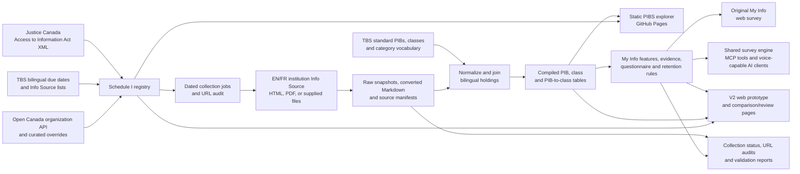
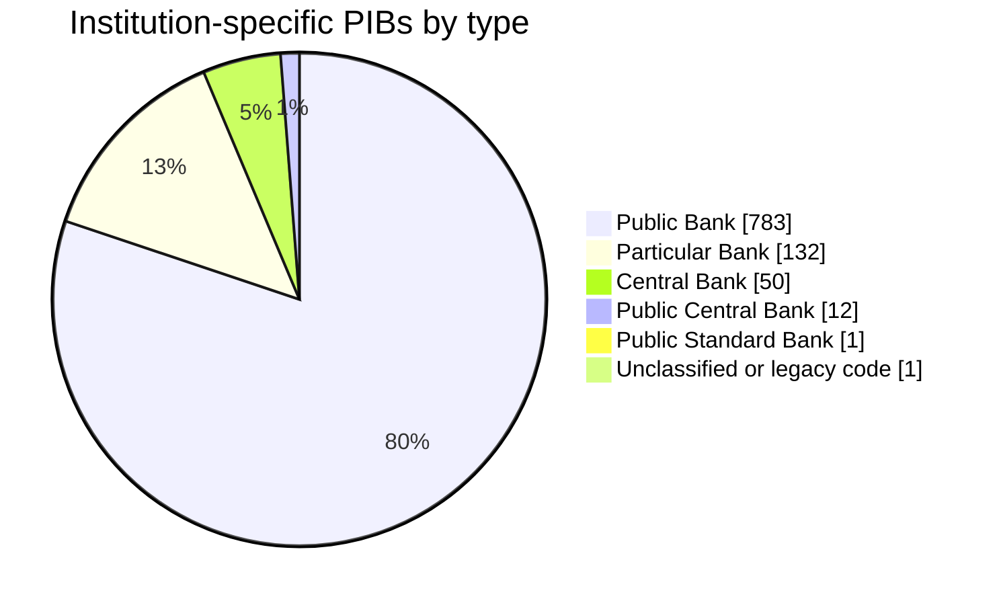
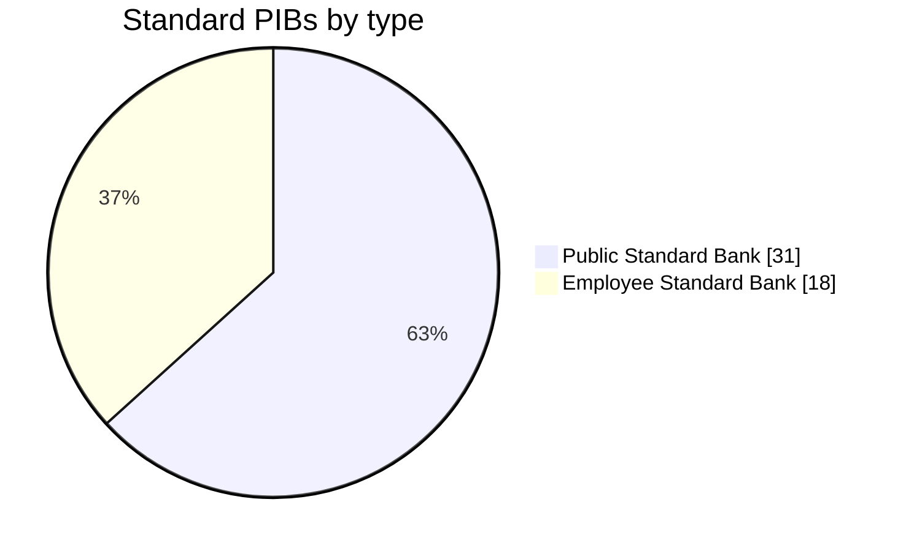

# pibs

## End-to-end data pipeline

The legal registry, source captures, extracted holdings, derived survey logic, and
published applications are separate layers. A source capture is evidence, not a
validated PIB; a derived category or survey match is an estimate, not an official
institutional assertion or proof that a person has a record.


```mermaid
flowchart LR
    A[Justice Canada<br/>Access to Information Act XML] --> R[Schedule I registry]
    B[TBS bilingual due dates<br/>and Info Source lists] --> R
    C[Open Canada organization API<br/>and curated overrides] --> R
    R --> J[Dated collection jobs<br/>and URL audit]
    J --> I[EN/FR institution Info Source<br/>HTML, PDF, or supplied files]
    D[TBS standard PIBs, classes<br/>and category vocabulary] --> X[Normalize and join<br/>bilingual holdings]
    I --> S[Raw snapshots, converted Markdown<br/>and source manifests]
    S --> X
    X --> H[Compiled PIB, class<br/>and PIB-to-class tables]
    H --> W[Static PIBS explorer<br/>GitHub Pages]
    H --> F[My Info features, evidence,<br/>questionnaire and retention rules]
    F --> V1[Original My Info<br/>web survey]
    F --> MCP[Shared survey engine<br/>MCP tools and voice-capable AI clients]
    F --> V2[V2 web prototype<br/>and comparison/review pages]
    R --> W
    H --> V2
    R --> V2
    S --> Q[Collection status, URL audits<br/>and validation reports]
    F --> Q
```

1. **Identify institutions and references.** `build_institution_registry.py` saves
   eight dated raw inputs with URLs, HTTP status, hashes, and byte counts: the
   Justice Canada Act XML (the authority for Schedule I membership), four
   Treasury Board EN/FR pages (publication deadlines and central Info Source
   lists), and three Open Canada API responses (organization directory and two
   datastore resources). It reconciles names and identifiers, applies
   `data/institution_registry_overrides.csv`, and writes the bilingual
   `institution_registry.csv`/`.xlsx` and `site/data/` copy. The TBS and API
   sources enrich the legal list; they do not define its membership.
2. **Plan and preserve collection.** `prepare_institution_collection_jobs.py`
   records the registry hash, stable institution ID, four EN/FR PIB/class URL
   roles, and snapshot date in `data/collection_jobs/*.jsonl`. The collector
   stores raw HTML/PDF, converts each role to Markdown, and records redirects,
   status, content type, checksum, errors, and discovered pages in each
   `source_manifest.json`. Dated supplemental captures can replace an older
   publication for extraction without deleting its original capture. A
   user-supplied file is explicitly identified as such in provenance.
3. **Extract and integrate.** `rebuild_institution_extractions.py` parses the
   selected bilingual sources into per-institution PIB and Class-of-Records
   CSVs. `compile_institution_tables.py` checks snapshot/parser compatibility,
   joins records to registry IDs, normalizes bilingual keys and PIB types,
   extracts explicit information-type lists, derives category candidates, and
   resolves PIB-to-class references. It writes comprehensive tables under
   `institutions_infosource_docs/` and copies them to `site/data/`. Separate
   TBS EN/FR scrapers produce the standard PIBs, standard classes, and 25-row
   personal-information category vocabulary.
4. **Derive products and publish.** `build_my_info_features.py` combines
   institution and standard PIBs into one-row-per-PIB features, category
   assignments, record-level evidence, the bilingual questionnaire, and a
   coverage summary under `data/derived/my_info/`. The original browser survey
   is built with `scripts/build_my_info_web.py`; the same V1 state engine is
   exported for stateless MCP tools used by conversational/voice-capable AI
   clients. Voice delivery depends on the client: this repository supplies
   the survey engine and tools, not a speech-recognition or speech-synthesis
   service. V2 uses its own activity routes and remains a separate review
   prototype. `build_site_assets.py` prepares the explorer's summary and
   display datasets. Three queued GitHub Actions workflows publish the main
   explorer, original survey, and V2/comparison into separate GitHub Pages
   paths; the voice/MCP endpoint has a separate deployment adapter and is **not**
   automatically updated by the Pages workflows.

### Per-institution source and extraction layout

The standard Schedule I unit is a stable
`institutions_infosource_docs/ati-schedule-i-<institution-id>/` directory:

```text
institutions_infosource_docs/
├── ati-schedule-i-<institution-id>/          # repeated for each collectable institution
│   ├── source_manifest.json                  # URLs, status, hashes, parser versions, counts
│   ├── pibs_en.md                             # selected EN source for PIB extraction
│   ├── pibs_fr.md                             # selected FR source for PIB extraction
│   ├── classes_of_records_en.md               # selected EN class source
│   ├── classes_of_records_fr.md               # selected FR class source
│   ├── pib_table_en_fr.csv                    # bilingual PIB rows; header even if empty
│   ├── cor_table_en_fr.csv                    # bilingual class rows; header even if empty
│   └── snapshots/
│       ├── <baseline-date>/raw/
│       │   ├── pibs_en.html|pdf                # one captured file per available role
│       │   ├── pibs_fr.html|pdf
│       │   ├── classes_of_records_en.html|pdf
│       │   └── classes_of_records_fr.html|pdf
│       └── <later-date>/supplemental/<source-id>/
│           ├── source.html|pdf                # optional newer or multipart source
│           └── source.md                      # its converted text
├── pib_table_en_fr_all.csv                    # compiled across institutions
├── cor_table_en_fr_all.csv
└── pib_cor_links.csv
```

One web page can fill both the PIB and class roles, so role files are not
necessarily distinct source publications. Some URLs fail or have no extractable
holdings; those outcomes remain visible in the manifest and trackers. The
directory currently contains 131 Schedule I folders and 37 older numeric-ID
folders for non-Schedule-I entries from the broader operational directory;
the latter are not the canonical Schedule I corpus.

### Logs, audits, and validation

The registry snapshot manifest and per-institution `source_manifest.json` files
provide URL, timestamp, HTTP, and checksum provenance. The job JSONL is the
reproducible work plan. `summarize_institution_collection.py` writes dated
institution-level status CSV and aggregate JSON (`data/collection_jobs/`),
including collected/error/missing-URL roles, zero-result institutions, and
error classes. `audit_institution_registry_urls.py` writes dated URL audits in
`data/audits/`; `audit_zero_pib_infosource_urls.py` produces
`infosource_zero_pib_url_report.json`. My Info writes per-record derivation
evidence, readability and match-coverage audits, and V1/V2 routing and
comparison reports under `data/derived/`, `data/audits/`, and `docs/`.
`site/data/site_summary.json` is the explorer's dataset/count manifest. These
are different measures: a successfully fetched page may still yield zero
records, and a dated status report need not equal a later compiled table.

The checks are layered. `validate_institution_collection.py` verifies job and
manifest identity, raw-file hashes and sizes, supplemental files, current parser
versions, and table headers. The compiler rejects missing/stale outputs and
duplicate canonical keys. `validate_data_model.py` checks primary/foreign keys
and bilingual controlled-vocabulary references. `validate_my_info_features.py`
checks one-to-one source/evidence coverage, unique assignments, valid categories,
route selectors, bilingual examples, and summary counts.
`validate_my_info_web.py` checks the original survey's generated contract;
`scripts/validate_my_info_deployment.py` checks V1/V2 path isolation;
`validate_site.py` checks dataset sizes, required fields, local links, and
required UI components. The Python `tests/` suite covers the parsers, registry,
categories, retention, survey engine and builds; Node tests cover V2 routing.
The three Pages workflows run their relevant build/validation subset, **not**
the entire extraction and Python test suite on every push. For a full local
review after changing sources or logic, run the appropriate rebuild commands
below, then:

```bash
.venv/bin/python validate_institution_collection.py --jobs-file data/collection_jobs/institution_collection_jobs_2026-08-15.jsonl
.venv/bin/python validate_data_model.py
.venv/bin/python validate_my_info_features.py
.venv/bin/python validate_my_info_web.py
.venv/bin/python scripts/validate_my_info_deployment.py
.venv/bin/python validate_site.py
.venv/bin/python -m unittest discover -s tests
node --test tests/my_info_v2.test.mjs
node --check site/app.js
node --check site/my_info/app.mjs
node --check site/my_info/engine.mjs
```

On hosts with snap-confined Chromium, the persona PDF smoke test may be unable
to write under `/tmp` even when Chromium exits successfully. For that test,
set `TMPDIR` to a temporary directory inside the checkout; the PDF test passed
with that setting on the 2026-09-28 verification run.

### Repository and source-volume snapshot

The following are **measured on the tracked files at commit `b4ab25d`
(2026-09-28, before this documentation change)**. Lines are physical newline
counts, not executable statements or CSV records; quoted CSV cells may span
several lines. Binary PDF, DOCX, XLSX, and PNG files have no line count. This
includes source captures and generated copies, so the total is not a measure
of hand-written code.

| File type | Tracked files | Physical lines |
| --- | ---: | ---: |
| HTML | 606 | 738,442 |
| Markdown | 711 | 513,844 |
| JSON | 168 | 203,600 |
| CSV | 307 | 29,558 |
| Python | 66 | 16,857 |
| JavaScript modules (`.mjs`) | 14 | 3,396 |
| JSONL | 2 | 1,188 |
| CSS | 6 | 1,102 |
| JavaScript (`.js`) | 2 | 636 |
| GitHub Actions YAML (`.yml`) | 4 | 264 |
| XML / YAML / TXT / extensionless | 43 | 276 |
| Binary PDF / PNG / XLSX / DOCX | 45 | — |
| **Total** | **1,974** | **1,509,163** |

The 66 Python files, 16 JavaScript/module files, six CSS files and four
workflow files account for about **22,255 physical lines** of implementation
and tests. The remaining text is primarily captured publications, normalized
records, evidence, documentation, and static output.

| Input or integrated product | Measured volume | Counting rule |
| --- | ---: | --- |
| Registry foundation | 8 raw responses | 1 Justice XML, 4 TBS HTML pages, 3 Open Canada API JSON responses; one dated snapshot |
| Schedule I registry / jobs | 148 institutions / 131 collectable | 17 lacked collection URLs in the dated job plan; Canadian Forces is consolidated under National Defence |
| Institution Info Source captures | 534 preserved raw copies | 512 HTML and 22 PDF validated for the 131 collectable Schedule I jobs: 380 baseline role files, 102 discovered linked pages and 52 later supplemental captures; repeated PIB/class roles may duplicate one publication |
| Distinct institution source locations | 313 URLs | Distinct final URLs among those 534 captured copies; 336 distinct SHA-256 payloads, because different captures at one URL can differ |
| Locally supplied supplemental captures | 2 | Included in the 52 supplements and marked as provided files, not successful live fetches |
| Separate TBS standard references | 4 live EN/FR pages | 2 standard-PIB/category pages and 2 standard-Class-of-Records pages; scraped outputs contain 49 standard PIBs, 33 standard classes and 25 categories |
| Current compiled holdings | 991 institution PIBs, 2,371 institution classes, 1,915 PIB-to-class links | Rows in the three comprehensive CSVs; with 49 standard PIBs, My Info's current feature table has 1,040 PIB rows |

The dated collection summary currently records 398 collected roles, 118 errors,
eight missing URLs and 68 not-applicable roles across 148 jobs; 103 of 131
collectable institutions had at least one source. This is a **snapshot of
collection**, not a claim that every publication was valid or that its older
row totals equal the latest compiled tables. Re-run the summarizer after a
source refresh before treating its percentages as current.

**Token and effort estimates are not usage logs.** The current preserved
institution HTML has about 71.2 million Unicode characters (roughly 17.8
million text-token equivalents at a simple four-characters-per-token rule);
the eight registry raw responses add about 0.34 million equivalents. The
converted institution Markdown is about 11.1 million equivalents, and the
compiled tables, My Info derived files, and entire static site together add
about 13.0 million more. These layers repeat the same source text and include
historical copies; PDF binary content is excluded. Across *all* tracked text,
the repository is on the order of **50–60 million token-equivalents**, not
50–60 million unique facts or actual AI input/output tokens. Tokenization,
language, and repeated processing can change real model usage substantially.
There are no complete per-run model token or active-reasoning-time logs in this
repository, so actual tokens generated or time spent reasoning cannot be
recovered defensibly from Git history. As a planning comparison, manually
reading and checking 313 source locations at 10–30 minutes each (52–157 hours),
reviewing 1,040 PIBs at 3–10 minutes each (52–173 hours), and integrating and
QA-ing the bilingual outputs (20–50 hours) would take roughly **125–380 hours
of focused analysis**, before any substantial manual transcription or web
development. An average person doing the entire pipeline manually would
likely need several hundred hours; this is an assumption-based workload range,
not a measured saving or a claim about historical AI reasoning time.

## Authoritative institution registry

`institution_registry.csv` is the bilingual registry of the 148 government institutions
listed in Schedule I of the Access to Information Act. Legal membership and names come only
from the Act XML. Treasury Board's bilingual publication-requirements appendices supply the
annual Info Source due date; Open Government's organization directory and two organization
datastore resources supply identifiers and metadata. Those enrichment sources never add or
remove a Schedule I institution.

The registry also records the English and French Info Source report URL and separate PIB and
Class-of-Records URLs when an institution publishes those holdings on another page. A blank URL
means that no sufficiently reliable institution report was found; it is not replaced by a fuzzy
match. Matching method, score, evidence URL, source URLs, validation result, and HTTP status are
retained in the output. Curated exceptions are reviewable in
`data/institution_registry_overrides.csv`.

Rebuild from a dated, reproducible raw-source snapshot and then audit the publication links:

```bash
.venv/bin/python build_institution_registry.py --snapshot-date 2026-08-15 --refresh
.venv/bin/python audit_institution_registry_urls.py --as-of-date 2026-08-15
.venv/bin/python -m unittest tests.test_institution_registry
```

Raw responses and their SHA-256 manifest are stored under
`data/raw/institution-registry/<date>/`; URL-audit metadata is stored under `data/audits/`.
The Excel equivalent is `institution_registry.xlsx`, and the site copy is
`site/data/institution_registry.csv`.

Treasury Board's due-date appendix currently contains 196 reporting entries because its stated
scope also covers parent Crown corporations and wholly owned subsidiaries. The 148-row registry
deliberately answers the Act Schedule I membership question. The pre-existing
`infosource_institutions_en_fr.csv` remains the broader operational publication directory and is
not a substitute for the legal registry.

### Institution content refresh

The current collector uses stable `institution_id` directories and preserves dated raw responses,
role-specific Markdown, source checksums, fetch results, and extraction counts. Prepare a job
manifest, run one or more disjoint batches, rebuild with the current parsers, and compile only
after every batch finishes:

```bash
.venv/bin/python prepare_institution_collection_jobs.py --snapshot-date 2026-08-15
.venv/bin/python collect_institution_content.py \
  --jobs-file data/collection_jobs/institution_collection_jobs_2026-08-15.jsonl \
  --batch-index 0 --batch-count 1
.venv/bin/python rebuild_institution_extractions.py \
  --jobs-file data/collection_jobs/institution_collection_jobs_2026-08-15.jsonl
.venv/bin/python compile_institution_tables.py \
  --jobs-file data/collection_jobs/institution_collection_jobs_2026-08-15.jsonl
.venv/bin/python summarize_institution_collection.py \
  --jobs-file data/collection_jobs/institution_collection_jobs_2026-08-15.jsonl \
  --status-csv data/collection_jobs/institution_collection_status_2026-08-15.csv \
  --summary-json data/collection_jobs/institution_collection_summary_2026-08-15.json
.venv/bin/python validate_institution_collection.py \
  --jobs-file data/collection_jobs/institution_collection_jobs_2026-08-15.jsonl
```

Each collectable institution receives `pib_table_en_fr.csv` and `cor_table_en_fr.csv`. The latter
has exactly `record_number`, `name_en`, `name_fr`, `document_types_en`, and `document_types_fr`.
The compiler writes registry-keyed comprehensive tables and site copies, and rejects stale parser
versions, missing outputs, or duplicate canonical keys.

Newer full Info Source publications can be stored as dated supplemental captures
with `collect_institution_supplement.py --replaces-previous`. The original raw
capture remains in the manifest, while the rebuilt PIB and class tables use
the replacement publication for its selected language roles.
For a user-saved page that cannot be fetched reliably, use `--local-file` with
its published `--url`; the manifest distinguishes this from a live HTTP fetch,
and the collection tracker counts it only while both raw and converted copies
remain available. Multi-page reports can be captured section by section, with
only the first section replacing the earlier publication. Where the local
machine cannot validate a source site's TLS chain, `--allow-unverified-tls`
records that limitation in each capture's provenance.

The dated status CSV and JSON summary distinguish successful retrievals, source errors, missing
URLs, and successful pages with zero extracted holdings. Including dated supplements through
2026-09-27, all 131 collectable institutions completed; 103 yielded at least one source, while
17 additional registry institutions had no publication URL suitable for collection.

The relational and controlled-vocabulary model is documented in `DATA_MODEL.md` and declared in
`data_model.json`. Validate its primary keys and foreign keys with:

```bash
.venv/bin/python validate_data_model.py
```

## My Info derived features

My Info is the business-logic layer for a future citizen questionnaire that estimates which
standard and institution-specific PIBs may be relevant to a person's government interactions.
It derives bilingual, evidence-backed personal-information categories, interaction topics,
citizen roles, service actions, grouped questionnaire questions, and conservative retention rules
for every PIB source row.

Build and validate the derived dataset with:

```bash
.venv/bin/python build_my_info_features.py --generated-date 2026-08-22
.venv/bin/python scripts/audit_my_info_readability.py
.venv/bin/python validate_my_info_features.py
```

Outputs are under `data/derived/my_info/`: a compact 1-row-per-PIB feature CSV, a normalized
PIB-to-category assignment CSV, full derivation evidence as JSONL, the bilingual questionnaire
contract, and a coverage summary. Category assignments and holding estimates are explicitly
derived—not confirmations that an institution has a record about a particular person. Detailed
matching and retention rules are documented in `MY_INFO_BUSINESS_LOGIC.md`.
The generated questionnaire now includes controlled answer values, Flesch Reading Ease
metadata for the English prompt, and bilingual progressive-help examples that name the
institution and activity. The full wording audit is in
`docs/MY_INFO_READABILITY_AUDIT.md`; Flesch is not used to judge the French copy. The proposed
browser and AI-agent architecture is in `MY_INFO_INTERFACE_ARCHITECTURE.md`.
The record-by-record survey matching review is in `docs/MY_INFO_MATCH_COVERAGE_AUDIT.md`;
it distinguishes direct matches, broad possible matches hidden by the web survey, and PIBs
that no current question can discover.

The first executable AI-tool layer is documented in `MY_INFO_AI_TOOLS.md`. It includes a
framework-neutral, client-owned survey state engine, 22 adaptive route groups, explicit
firearms and boating questions, and four read-only MCP tools. Export their machine-readable
schemas and run the local server with:

```bash
.venv/bin/python scripts/export_my_info_mcp_tools.py
.venv/bin/python -m my_info.mcp_server
```

Remote AI clients can connect to the stateless Streamable HTTP endpoint at
`https://lovely-nasturtium-97f019.netlify.app/my-info/mcp`. The portable Netlify runtime and the
repo-contained `plugins/my-info-canada` conversational skill/plugin are also maintained here;
`ckan-mcp-netlify` contains only the thin deployment adapter and a pinned generated bundle.

The same state machine also powers a semi-standalone browser Beta under `site/my_info/`.
It keeps answers in the current browser tab, supports English and French, presents the
question/refinement/timing/department tree, and groups results by retention estimate and institution.
It is published independently from the data explorer at
`https://patlittle.github.io/pibs/my_info/`; its workflow updates only the `my_info/`
folder on the `pages` branch.
Rebuild it from the canonical MCP engine and derived data with:

```bash
.venv/bin/python scripts/build_my_info_web.py
.venv/bin/python validate_my_info_web.py
.venv/bin/python -m unittest tests.test_build_my_info_web
node --check site/my_info/app.mjs
node --check site/my_info/engine.mjs
```

## Static data explorer

### Side-by-side survey deployment

`site/prototype-label.css` is a reusable, optional label for a GCDS header.
Place this signature slot inside `<gcds-header>`, and link to the stylesheet
from the page to show the label directly above the unchanged GCDS signature:

```html
<link rel="stylesheet" href="prototype-label.css">
<div class="prototype-signature" slot="signature">
  <span class="prototype-label-text" style="display:none">Prototype - For Discussion</span>
  <gcds-signature></gcds-signature>
</div>
```

Remove the stylesheet link to hide the label. The baseline inline display
rule hides it when the optional stylesheet is absent; the stylesheet makes
the text visible to sighted users and assistive technology.

The original survey and the V2 comparison prototype have independent URLs:

- [Original survey](https://patlittle.github.io/pibs/my_info/)
- [V2 prototype](https://patlittle.github.io/pibs/my_info_v2/)
- [Comparison and printable logic documents](https://patlittle.github.io/pibs/my_info_compare/)

Development versions remain on `codex/my-info-v1-review` and `codex/my-info-v2`.
Publishing is controlled by `main`, not by pushing either feature branch. Promote only
the intended version's source and generated files to `main`; do not swap directory names.

The explorer workflow excludes and preserves all three survey directories. The original
survey workflow owns only `my_info/`; `deploy-my-info-v2-pages.yml` owns only `my_info_v2/`
and `my_info_compare/`. All three writers share the `pages-branch-deploy` concurrency
group with `queue: max`, use non-forced pushes, and reject manual deployment from non-main branches.
The expanded queue prevents one pending publisher from replacing another when a single
data update triggers all three; see [GitHub's concurrency documentation](https://docs.github.com/en/actions/reference/workflows-and-actions/workflow-syntax#concurrency).
Thus an explorer refresh or a V2 release cannot clean away or replace the original survey.

Rebuild the comparison release with:

```bash
python3 scripts/export_my_info_v1_review.py
python3 scripts/build_my_info_v2.py
node scripts/compare_my_info_surveys.mjs
node --test tests/my_info_v2.test.mjs
python3 scripts/validate_my_info_deployment.py
```

For a local trial, serve `site/` over HTTP (`python3 -m http.server 8766 --directory site`)
and open `http://localhost:8766/my_info_compare/`. Do not open the source HTML using
`file://`: both applications fetch generated JSON and modules from their served directory.
The V2 workflow validates both engines remain separate; it does not publish the V2 engine
to the existing voice/MCP endpoint. V2 remains a clearly labelled review prototype, not a
claim of production-ready automatic coverage.

### Explorer assets

The GitHub Pages site is built from the compiled CSVs. Its landing page provides overview and
quality statistics, while `site/table.html` supplies a reusable searchable view for the
authoritative institution registry, institution PIBs, institution Classes of Records,
PIB-to-class links, standard holdings, and controlled vocabularies. Record dialogs link between
the related tables using `institution_id`, `bank_number_key`, and class record keys.

Rebuild and validate the deployable site assets with:

```bash
.venv/bin/python build_site_assets.py
.venv/bin/python validate_site.py
node --check site/app.js
node --check site/overview.js
```

## Standard classes of records

Run `python scrape_standard_classes_of_records.py` to retrieve the English and French
Canada.ca source pages and rebuild `standard_classes_of_records_en_fr.csv`. English
`PRN ###` entries are paired with French `NDP ###` entries by their shared numeric code;
the script stops if either language is missing a matching record.

## PIB types

`pib_types.py` contains the Annex B lookup used by `spib_scraper_(1).py` and
`compile_institution_tables.py`. Both bilingual PIB outputs include a `pib_type` column derived
from the bank code. Codes outside the six Annex B families are left unclassified.

The registry-driven institution PIB compiler also derives
`specific_information_types_en` and `specific_information_types_fr` from explicit lists in the
source descriptions (for example, “Personal information may include…”). Each CSV cell is a JSON
array that retains the source language and source order. Empty arrays mean that no explicit list
was found; the extractor does not infer types from general program prose, and generic catch-all
phrases such as “other personal information in relevant records” are excluded.

The compiler conceptually maps each PIB's descriptions and extracted information types to the
official 25-row taxonomy. It stores JSON arrays in
`standard_personal_information_category_ids`,
`standard_personal_information_categories_en`, and
`standard_personal_information_categories_fr`. These are derived estimates, not categories
explicitly assigned by the publishing institution. Canadian Forces holdings are consolidated
under Department of National Defence and excluded from the combined holdings table.

`spib_scraper_(1).py` also rebuilds `pi_categories_en_fr.csv` from the bilingual
Categories of Personal Information lists. `PI_CAT-1` through `PI_CAT-25` follow the
English source order and are paired to the differently ordered French list by translated name.

### Institution-specific PIBs by type


```mermaid
pie showData
    title Institution-specific PIBs by type
    "Public Bank" : 783
    "Particular Bank" : 132
    "Central Bank" : 50
    "Public Central Bank" : 12
    "Public Standard Bank" : 1
    "Unclassified or legacy code" : 1
```

### Standard PIBs by type


```mermaid
pie showData
    title Standard PIBs by type
    "Public Standard Bank" : 31
    "Employee Standard Bank" : 18
```

## Institution change tracking

Run `python infosource_institutions_en_fr.py` to refresh the legacy operational publication list.
Run `python audit_zero_pib_infosource_urls.py` to audit every institution with a zero or
empty PIB count, follow redirects, recover missing language links, build eligible bilingual
Markdown corpora and PIB tables, and write `infosource_zero_pib_url_report.json`.
The process preserves organizations that disappear from the public list and maintains:

- `pib_count`: number of rows for the organization in `pib_table_en_fr_all.csv`
- `date_captured`: first date the organization was captured (`2026-03-11` for the baseline data)
- `date_removed`: first refresh date on which the list entry was absent from both language lists
- `status_statut`: organization status from the Open Government Organization Information resource

Exact historical institution-name matches are reused when a current list entry does not resolve
through CKAN, which prevents English and French entries from being split during later refreshes.

Schedule I institutions always write to the registry's stable `ati-schedule-i-*` content folder,
including when these legacy operational refresh tools are used. Numeric content folders remain
only for operational-directory entities that do not have a Schedule I registry counterpart.
