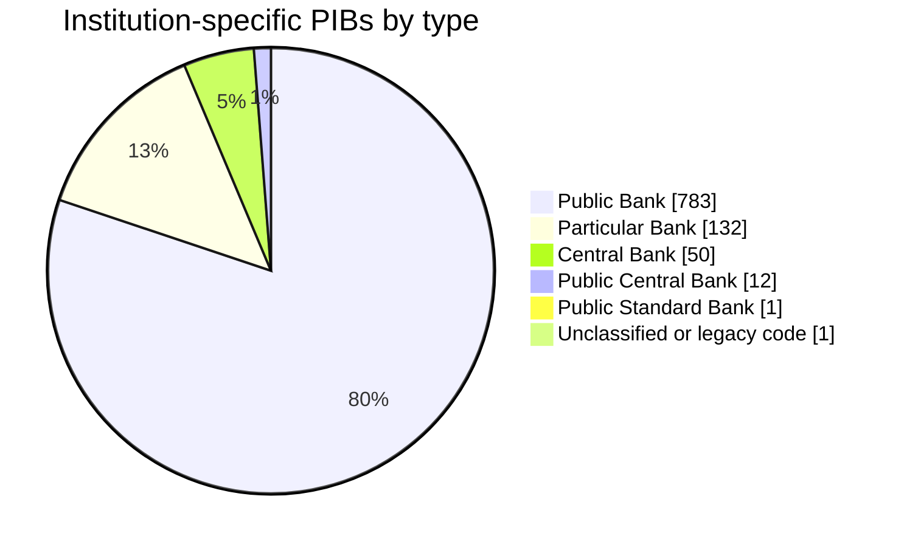
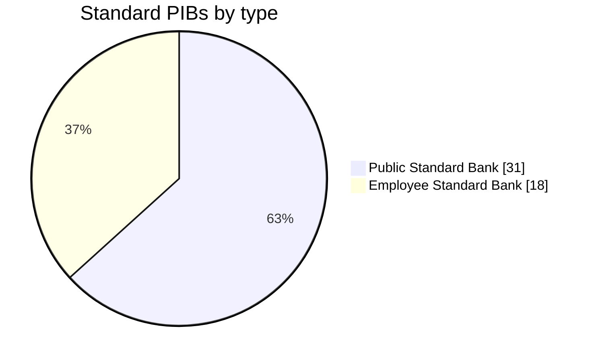

# pibs

## Authoritative institution registry

`institution_registry.csv` is the bilingual registry of the 148 government institutions
listed in Schedule I of the Access to Information Act. Legal membership and names come only
from the Act XML. Treasury Board's bilingual publication-requirements appendices supply the
annual Info Source due date; Open Government's organization directory and two organization
datastore resources supply identifiers and metadata. Those enrichment sources never add or
remove a Schedule I institution.

The registry also records the English and French Info Source report URL and separate PIB and
Class-of-Records URLs when an institution publishes those holdings on another page. A blank URL
means that no sufficiently reliable institution report was found; it is not replaced by a fuzzy
match. Matching method, score, evidence URL, source URLs, validation result, and HTTP status are
retained in the output. Curated exceptions are reviewable in
`data/institution_registry_overrides.csv`.

Rebuild from a dated, reproducible raw-source snapshot and then audit the publication links:

```bash
.venv/bin/python build_institution_registry.py --snapshot-date 2026-08-15 --refresh
.venv/bin/python audit_institution_registry_urls.py --as-of-date 2026-08-15
.venv/bin/python -m unittest tests.test_institution_registry
```

Raw responses and their SHA-256 manifest are stored under
`data/raw/institution-registry/<date>/`; URL-audit metadata is stored under `data/audits/`.
The Excel equivalent is `institution_registry.xlsx`, and the site copy is
`site/data/institution_registry.csv`.

Treasury Board's due-date appendix currently contains 196 reporting entries because its stated
scope also covers parent Crown corporations and wholly owned subsidiaries. The 148-row registry
deliberately answers the Act Schedule I membership question. The pre-existing
`infosource_institutions_en_fr.csv` remains the broader operational publication directory and is
not a substitute for the legal registry.

### Institution content refresh

The current collector uses stable `institution_id` directories and preserves dated raw responses,
role-specific Markdown, source checksums, fetch results, and extraction counts. Prepare a job
manifest, run one or more disjoint batches, rebuild with the current parsers, and compile only
after every batch finishes:

```bash
.venv/bin/python prepare_institution_collection_jobs.py --snapshot-date 2026-08-15
.venv/bin/python collect_institution_content.py \
  --jobs-file data/collection_jobs/institution_collection_jobs_2026-08-15.jsonl \
  --batch-index 0 --batch-count 1
.venv/bin/python rebuild_institution_extractions.py \
  --jobs-file data/collection_jobs/institution_collection_jobs_2026-08-15.jsonl
.venv/bin/python compile_institution_tables.py \
  --jobs-file data/collection_jobs/institution_collection_jobs_2026-08-15.jsonl
.venv/bin/python summarize_institution_collection.py \
  --jobs-file data/collection_jobs/institution_collection_jobs_2026-08-15.jsonl \
  --status-csv data/collection_jobs/institution_collection_status_2026-08-15.csv \
  --summary-json data/collection_jobs/institution_collection_summary_2026-08-15.json
.venv/bin/python validate_institution_collection.py \
  --jobs-file data/collection_jobs/institution_collection_jobs_2026-08-15.jsonl
```

Each collectable institution receives `pib_table_en_fr.csv` and `cor_table_en_fr.csv`. The latter
has exactly `record_number`, `name_en`, `name_fr`, `document_types_en`, and `document_types_fr`.
The compiler writes registry-keyed comprehensive tables and site copies, and rejects stale parser
versions, missing outputs, or duplicate canonical keys.

Newer full Info Source publications can be stored as dated supplemental captures
with `collect_institution_supplement.py --replaces-previous`. The original raw
capture remains in the manifest, while the rebuilt PIB and class tables use
the replacement publication for its selected language roles.
For a user-saved page that cannot be fetched reliably, use `--local-file` with
its published `--url`; the manifest distinguishes this from a live HTTP fetch,
and the collection tracker counts it only while both raw and converted copies
remain available. Multi-page reports can be captured section by section, with
only the first section replacing the earlier publication. Where the local
machine cannot validate a source site's TLS chain, `--allow-unverified-tls`
records that limitation in each capture's provenance.

The dated status CSV and JSON summary distinguish successful retrievals, source errors, missing
URLs, and successful pages with zero extracted holdings. Including dated supplements through
2026-09-27, all 131 collectable institutions completed; 103 yielded at least one source, while
17 additional registry institutions had no publication URL suitable for collection.

The relational and controlled-vocabulary model is documented in `DATA_MODEL.md` and declared in
`data_model.json`. Validate its primary keys and foreign keys with:

```bash
.venv/bin/python validate_data_model.py
```

## My Info derived features

My Info is the business-logic layer for a future citizen questionnaire that estimates which
standard and institution-specific PIBs may be relevant to a person's government interactions.
It derives bilingual, evidence-backed personal-information categories, interaction topics,
citizen roles, service actions, grouped questionnaire questions, and conservative retention rules
for every PIB source row.

Build and validate the derived dataset with:

```bash
.venv/bin/python build_my_info_features.py --generated-date 2026-08-22
.venv/bin/python scripts/audit_my_info_readability.py
.venv/bin/python validate_my_info_features.py
```

Outputs are under `data/derived/my_info/`: a compact 1-row-per-PIB feature CSV, a normalized
PIB-to-category assignment CSV, full derivation evidence as JSONL, the bilingual questionnaire
contract, and a coverage summary. Category assignments and holding estimates are explicitly
derived—not confirmations that an institution has a record about a particular person. Detailed
matching and retention rules are documented in `MY_INFO_BUSINESS_LOGIC.md`.
The generated questionnaire now includes controlled answer values, Flesch Reading Ease
metadata for the English prompt, and bilingual progressive-help examples that name the
institution and activity. The full wording audit is in
`docs/MY_INFO_READABILITY_AUDIT.md`; Flesch is not used to judge the French copy. The proposed
browser and AI-agent architecture is in `MY_INFO_INTERFACE_ARCHITECTURE.md`.
The record-by-record survey matching review is in `docs/MY_INFO_MATCH_COVERAGE_AUDIT.md`;
it distinguishes direct matches, broad possible matches hidden by the web survey, and PIBs
that no current question can discover.

The first executable AI-tool layer is documented in `MY_INFO_AI_TOOLS.md`. It includes a
framework-neutral, client-owned survey state engine, 22 adaptive route groups, explicit
firearms and boating questions, and four read-only MCP tools. Export their machine-readable
schemas and run the local server with:

```bash
.venv/bin/python scripts/export_my_info_mcp_tools.py
.venv/bin/python -m my_info.mcp_server
```

Remote AI clients can connect to the stateless Streamable HTTP endpoint at
`https://lovely-nasturtium-97f019.netlify.app/my-info/mcp`. The portable Netlify runtime and the
repo-contained `plugins/my-info-canada` conversational skill/plugin are also maintained here;
`ckan-mcp-netlify` contains only the thin deployment adapter and a pinned generated bundle.

The same state machine also powers a semi-standalone browser Beta under `site/my_info/`.
It keeps answers in the current browser tab, supports English and French, presents the
question/refinement/timing/department tree, and groups results by retention estimate and institution.
It is published independently from the data explorer at
`https://patlittle.github.io/pibs/my_info/`; its workflow updates only the `my_info/`
folder on the `pages` branch.
Rebuild it from the canonical MCP engine and derived data with:

```bash
.venv/bin/python scripts/build_my_info_web.py
.venv/bin/python validate_my_info_web.py
.venv/bin/python -m unittest tests.test_build_my_info_web
node --check site/my_info/app.mjs
node --check site/my_info/engine.mjs
```

## Static data explorer

### Side-by-side survey deployment

`site/prototype-label.css` is a reusable, optional label for a GCDS header.
Place this signature slot inside `<gcds-header>`, and link to the stylesheet
from the page to show the label directly above the unchanged GCDS signature:

```html
<link rel="stylesheet" href="prototype-label.css">
<div class="prototype-signature" slot="signature">
  <span class="prototype-label-text" style="display:none">Prototype - For Discussion</span>
  <gcds-signature></gcds-signature>
</div>
```

Remove the stylesheet link to hide the label. The baseline inline display
rule hides it when the optional stylesheet is absent; the stylesheet makes
the text visible to sighted users and assistive technology.

The original survey and the V2 comparison prototype have independent URLs:

- [Original survey](https://patlittle.github.io/pibs/my_info/)
- [V2 prototype](https://patlittle.github.io/pibs/my_info_v2/)
- [Comparison and printable logic documents](https://patlittle.github.io/pibs/my_info_compare/)

Development versions remain on `codex/my-info-v1-review` and `codex/my-info-v2`.
Publishing is controlled by `main`, not by pushing either feature branch. Promote only
the intended version's source and generated files to `main`; do not swap directory names.

The explorer workflow excludes and preserves all three survey directories. The original
survey workflow owns only `my_info/`; `deploy-my-info-v2-pages.yml` owns only `my_info_v2/`
and `my_info_compare/`. All three writers share the `pages-branch-deploy` concurrency
group with `queue: max`, use non-forced pushes, and reject manual deployment from non-main branches.
The expanded queue prevents one pending publisher from replacing another when a single
data update triggers all three; see [GitHub's concurrency documentation](https://docs.github.com/en/actions/reference/workflows-and-actions/workflow-syntax#concurrency).
Thus an explorer refresh or a V2 release cannot clean away or replace the original survey.

Rebuild the comparison release with:

```bash
python3 scripts/export_my_info_v1_review.py
python3 scripts/build_my_info_v2.py
node scripts/compare_my_info_surveys.mjs
node --test tests/my_info_v2.test.mjs
python3 scripts/validate_my_info_deployment.py
```

For a local trial, serve `site/` over HTTP (`python3 -m http.server 8766 --directory site`)
and open `http://localhost:8766/my_info_compare/`. Do not open the source HTML using
`file://`: both applications fetch generated JSON and modules from their served directory.
The V2 workflow validates both engines remain separate; it does not publish the V2 engine
to the existing voice/MCP endpoint. V2 remains a clearly labelled review prototype, not a
claim of production-ready automatic coverage.

### Explorer assets

The GitHub Pages site is built from the compiled CSVs. Its landing page provides overview and
quality statistics, while `site/table.html` supplies a reusable searchable view for the
authoritative institution registry, institution PIBs, institution Classes of Records,
PIB-to-class links, standard holdings, and controlled vocabularies. Record dialogs link between
the related tables using `institution_id`, `bank_number_key`, and class record keys.

Rebuild and validate the deployable site assets with:

```bash
.venv/bin/python build_site_assets.py
.venv/bin/python validate_site.py
node --check site/app.js
node --check site/overview.js
```

## Standard classes of records

Run `python scrape_standard_classes_of_records.py` to retrieve the English and French
Canada.ca source pages and rebuild `standard_classes_of_records_en_fr.csv`. English
`PRN ###` entries are paired with French `NDP ###` entries by their shared numeric code;
the script stops if either language is missing a matching record.

## PIB types

`pib_types.py` contains the Annex B lookup used by `spib_scraper_(1).py` and
`compile_institution_tables.py`. Both bilingual PIB outputs include a `pib_type` column derived
from the bank code. Codes outside the six Annex B families are left unclassified.

The registry-driven institution PIB compiler also derives
`specific_information_types_en` and `specific_information_types_fr` from explicit lists in the
source descriptions (for example, “Personal information may include…”). Each CSV cell is a JSON
array that retains the source language and source order. Empty arrays mean that no explicit list
was found; the extractor does not infer types from general program prose, and generic catch-all
phrases such as “other personal information in relevant records” are excluded.

The compiler conceptually maps each PIB's descriptions and extracted information types to the
official 25-row taxonomy. It stores JSON arrays in
`standard_personal_information_category_ids`,
`standard_personal_information_categories_en`, and
`standard_personal_information_categories_fr`. These are derived estimates, not categories
explicitly assigned by the publishing institution. Canadian Forces holdings are consolidated
under Department of National Defence and excluded from the combined holdings table.

`spib_scraper_(1).py` also rebuilds `pi_categories_en_fr.csv` from the bilingual
Categories of Personal Information lists. `PI_CAT-1` through `PI_CAT-25` follow the
English source order and are paired to the differently ordered French list by translated name.

### Institution-specific PIBs by type


```mermaid
pie showData
    title Institution-specific PIBs by type
    "Public Bank" : 783
    "Particular Bank" : 132
    "Central Bank" : 50
    "Public Central Bank" : 12
    "Public Standard Bank" : 1
    "Unclassified or legacy code" : 1
```

### Standard PIBs by type


```mermaid
pie showData
    title Standard PIBs by type
    "Public Standard Bank" : 31
    "Employee Standard Bank" : 18
```

## Institution change tracking

Run `python infosource_institutions_en_fr.py` to refresh the legacy operational publication list.
Run `python audit_zero_pib_infosource_urls.py` to audit every institution with a zero or
empty PIB count, follow redirects, recover missing language links, build eligible bilingual
Markdown corpora and PIB tables, and write `infosource_zero_pib_url_report.json`.
The process preserves organizations that disappear from the public list and maintains:

- `pib_count`: number of rows for the organization in `pib_table_en_fr_all.csv`
- `date_captured`: first date the organization was captured (`2026-03-11` for the baseline data)
- `date_removed`: first refresh date on which the list entry was absent from both language lists
- `status_statut`: organization status from the Open Government Organization Information resource

Exact historical institution-name matches are reused when a current list entry does not resolve
through CKAN, which prevents English and French entries from being split during later refreshes.

Schedule I institutions always write to the registry's stable `ati-schedule-i-*` content folder,
including when these legacy operational refresh tools are used. Numeric content folders remain
only for operational-directory entities that do not have a Schedule I registry counterpart.
